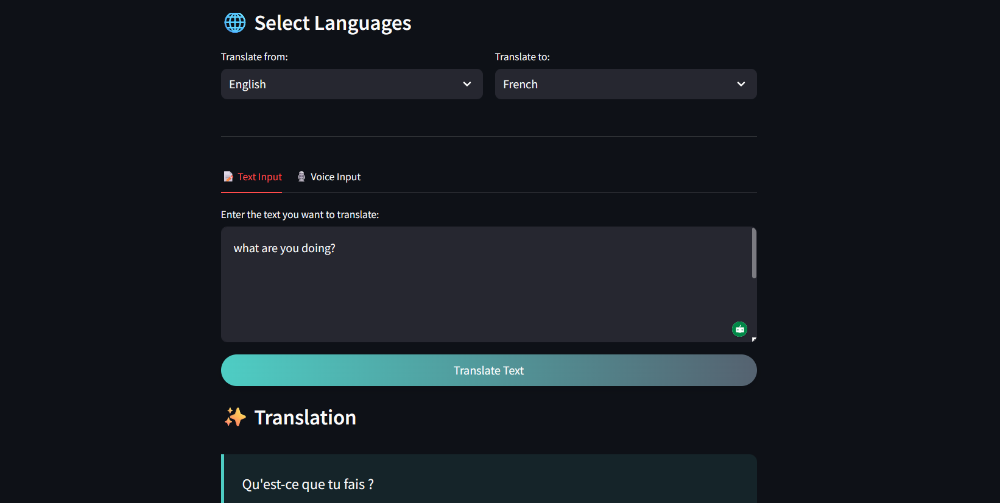

# Instant translate AI
This project is a multi-language translator built using **Google's Gemini  model and **Streamlit**. It allows users to translate text between over 50 languages through a simple and interactive web interface.

---

## 📝 Introduction
The Gemini Language Translator leverages the power of **Large Language Models (LLMs)** to provide accurate, context-aware translations across a wide range of languages. The interface is built with **Streamlit**, ensuring a clean and fast user experience.

---

## 📸 Screenshots




---

## 🌟 Features

- 🔠 **Supports Over 50 Languages**: Including English, Spanish, Arabic, Hindi, French, Chinese, Yoruba, Japanese, Russian, and more.
- 🤖 **Powered by Gemini AI**: Uses `gemini model` for intelligent, high-quality translations.
- 💬 **Text-to-Speech (Optional)**: Hear the translated result spoken aloud (on supported devices).
- 🖼️ **Clean UI**: Designed using **Streamlit** and custom CSS for an intuitive layout.
- 📦 **Lightweight Deployment**: Can be hosted locally or deployed on platforms like Streamlit Cloud.

---

## 💻 Technologies Used

| Tech | Purpose |
|------|---------|
| **Streamlit** | UI framework for interactive apps |
| **Python** | Core programming language |
| **google-generativeai** | API client for Gemini |
| **dotenv** | Securely store and load API keys |
| **pyttsx3** | Optional: Text-to-speech engine |

---

## ⚙️ Installation

Follow these steps to set up the project locally:

1. **Clone the Repository**

   ```bash
   git clone https://github.com/Osisehh/Gemini-Language-Translator
   cd Gemini-Language-Translator
2. **Clone the Repository**
   
   ```bash
   # Create venv (optional but recommended)
   python -m venv venv

   # Activate (Windows)
   venv\Scripts\activate

   # Activate (macOS/Linux)
   source venv/bin/activate

3. **Install the Requirements **
   
   ```bash
   pip install -r requirements.txt
   
4. Set Up Environment Variables

    ```ini
   GOOGLE_API_KEY=your-gemini-api-key-here


## 🚀 Usage

1. **Run the App**
   
    ```bash
   streamlit run app.py

2. **Open in Your Browser**

   Navigate to http://localhost:8501 in your browser.
   
4. **Translate**
   - Select the source and target language.
   - Enter the text you want to translate.
   - Click "Translate" to view the translated result.
   - Optionally check "Read Aloud" to hear the translation.

## 🌍 Supported Languages (Partial List)

- English
- Spanish
- French
- German
- Urdu
- Hindi
- Chinese
- Japanese
- Yoruba
- Igbo
- And many more...

## 📜 License
This project is licensed under the MIT License.


## 🙏 Acknowledgments
- Thanks to Google for the Gemini API.
- Inspired by the power of LLMs in breaking language barriers.
- Big love to the open-source community for tools like Streamlit and dotenv.
